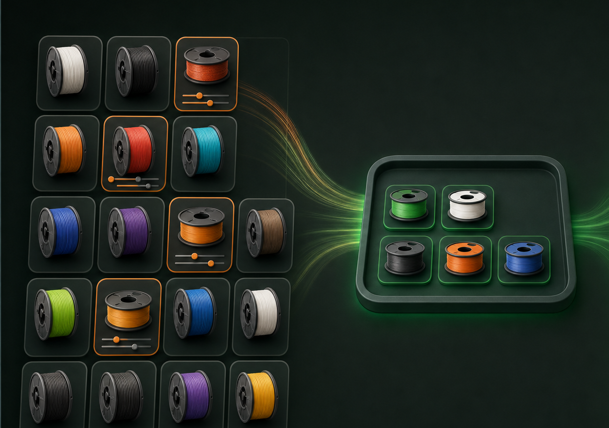
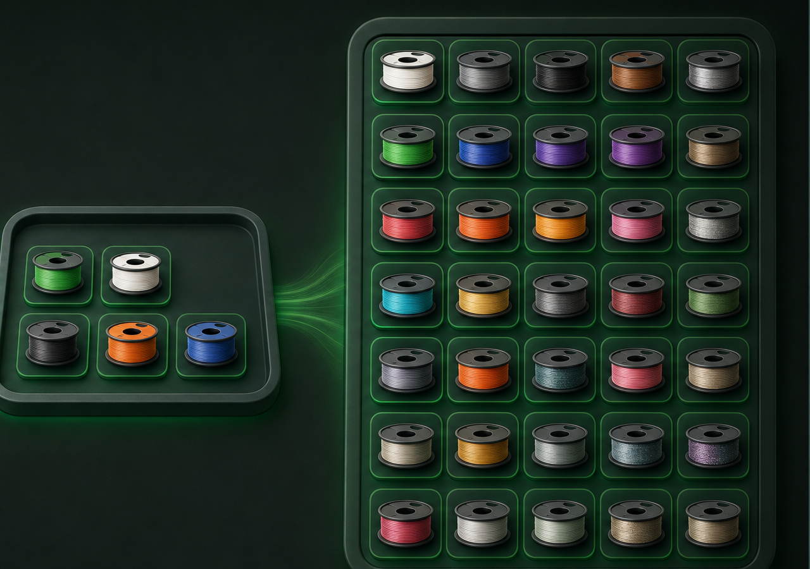
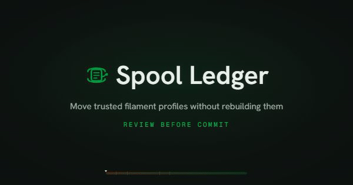
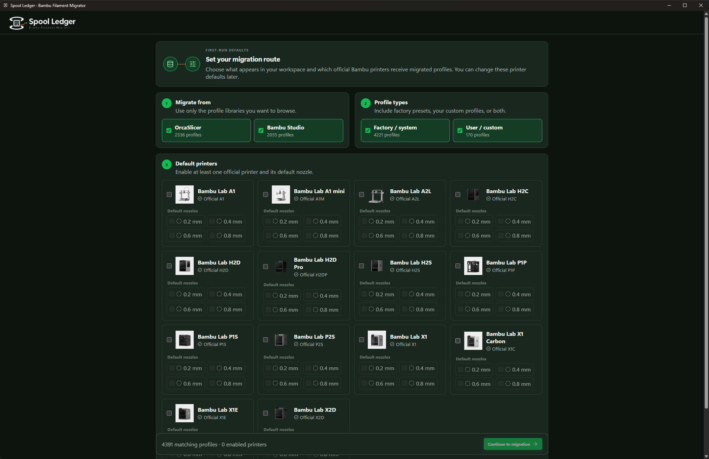
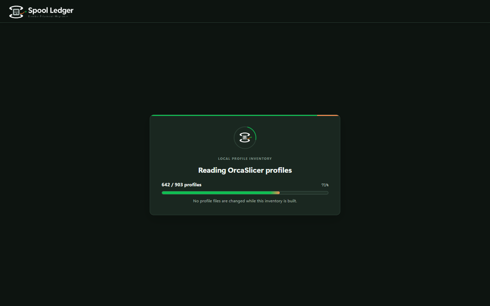
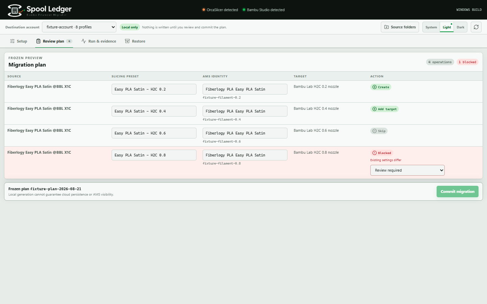
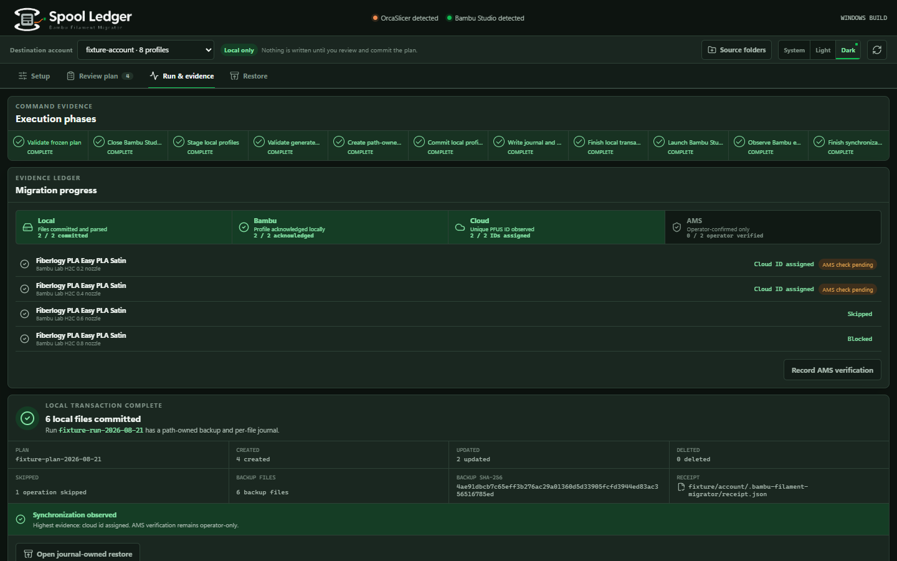
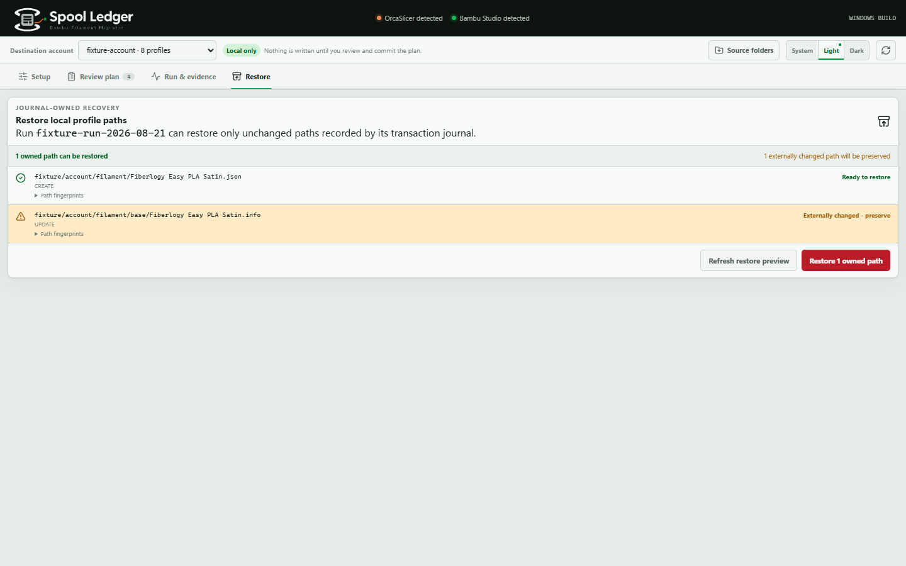
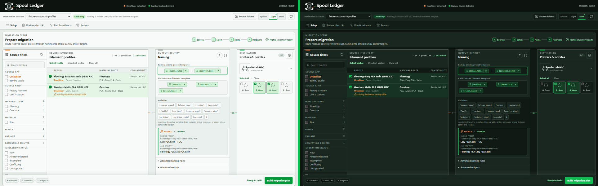

<p align="center">
  
</p>

<h1 align="center">Spool Ledger</h1>

<p align="center">
  <strong>Bambu Filament Migrator</strong><br />
  Bring your Orca filament profiles into Bambu Studio without setting them up again.
</p>

<p align="center">
  Choose built-in or custom Orca profiles, select the printers and nozzles you use, review the result, and let Bambu Studio handle its normal synchronization flow.
</p>

<p align="center">
  <code>Windows 11</code>&nbsp;&nbsp;·&nbsp;&nbsp;<code>Local-first</code>&nbsp;&nbsp;·&nbsp;&nbsp;<code>No telemetry</code>&nbsp;&nbsp;·&nbsp;&nbsp;<code>AGPL-3.0</code>
</p>

## Product showcase

https://github.com/user-attachments/assets/c8625391-d9cf-4cdc-ac9a-dd7475e481dd

Watch the 67-second showcase with narration and music. It demonstrates local profile creation, followed by the Bambu Studio and AMS handoff.

## Keep the profiles you already tuned

Bambu Studio normally presents Bambu and Generic filament choices. Spool Ledger lets you select compatible profiles you already use in OrcaSlicer, including built-in profiles and your own custom profiles, then prepare them for Bambu Studio through a reviewed local migration.

<table>
  <tr>
    <td width="50%">
      
    </td>
    <td width="50%">
      
    </td>
  </tr>
  <tr>
    <td align="center"><strong>Choose what you want</strong><br />Built-in profiles, custom profiles, and only the hardware you use.</td>
    <td align="center"><strong>Keep more useful choices</strong><br />Reuse your tuned settings instead of rebuilding them one by one.</td>
  </tr>
</table>

### Why use Spool Ledger?

- **Save setup time.** Move several compatible profiles together instead of typing settings again.
- **Choose your own library.** Use supported OrcaSlicer system profiles or your own custom profiles.
- **Limit the result.** Select only the official Bambu printers and nozzle diameters you use.
- **Review before writing.** See exact names, operations, conflicts, and blocked items in a frozen plan.
- **Stay local.** Spool Ledger does not ask for Bambu credentials or call undocumented cloud APIs.
- **Restore safely.** Restore only files still owned by a migration run, without unpacking an entire account backup.

## See the workflow

<p align="center">
  <a href="#product-showcase">
    
  </a>
</p>

| 1. Choose                                               | 2. Review                                | 3. Run                                                               | 4. Confirm                                                               |
| ------------------------------------------------------- | ---------------------------------------- | -------------------------------------------------------------------- | ------------------------------------------------------------------------ |
| Select source profiles, official printers, and nozzles. | Inspect the exact frozen migration plan. | Commit the reviewed local transaction and watch each evidence level. | Let Bambu Studio update normally, then check the result in AMS yourself. |

## Interface

### First-run setup



Choose OrcaSlicer, Bambu Studio, or both as sources. Select factory or custom profiles, enable official printers, and set default nozzles. The destination manager can change these defaults later. This screenshot shows the actual desktop application's printer cards and installed artwork.

### Profile inventory



Spool Ledger discovers supported profiles and reports real loaded and total counts. Source files are not changed while the inventory is built.

### Frozen plan review



Every plan is read-only and fingerprinted. Blocked operations must be resolved, skipped, or renamed safely before commit can begin. Missing target templates are never fabricated.

### Run and evidence



Local creation, Bambu Studio loading, cloud ID assignment, and human AMS verification are recorded as separate states. The screenshot uses synthetic cloud-ID evidence and leaves AMS verification pending.

### Journal-owned restore



Restore previews every run-owned path. If another process changed a migrated file later, Spool Ledger preserves it instead of overwriting it.

### Light and dark themes



System, light, and dark modes use the same migration workflow.

## Product videos

| Video                                                                             | What it shows                                                                                           | Length |
| --------------------------------------------------------------------------------- | ------------------------------------------------------------------------------------------------------- | -----: |
| [Product-facing showcase V3](#product-showcase)                                   | A real app recording of local profile creation, followed by the Bambu Studio and AMS handoff            | 67.05s |
| [Plain-language promo V2](docs/marketing/videos/spool-ledger-promo-v2.mp4)        | Saved setup time, built-in and custom Orca profile choice, and the normal Bambu Studio plus AMS handoff | 48.04s |
| [Earlier approved live showcase](docs/marketing/videos/spool-ledger-showcase.mp4) | A real migration of Overture Matte PLA and Overture PLA Pro with private local details hidden           | 50.13s |
| [Silent promo master](docs/marketing/videos/spool-ledger-promo-silent.mp4)        | The campaign without narration or music                                                                 | 48.04s |
| [Logo treatment](docs/marketing/videos/spool-ledger-logo-reveal.mp4)              | Reusable Spool Ledger brand reveal                                                                      |  5.06s |
| [Synthetic workflow tour](docs/demo/spool-ledger-product-tour.mp4)                | A complete temporary-root demonstration with no live profile writes                                     |   ~60s |
| [Synthetic narrated tour](docs/demo/spool-ledger-product-tour-voiceover.mp4)      | The same isolated demonstration with disclosed AI narration                                             |   ~60s |

The V3 showcase narration and music were generated with ElevenLabs. The V2 promo narration and music were also generated with ElevenLabs; its profile-choice concept illustration was generated with GPT Image 2. The earlier live showcase narration was generated with OpenAI. See the complete [AI and media disclosure](docs/marketing/AI-DISCLOSURE.md).

> [!IMPORTANT]
> The V3 showcase demonstrates local creation; its Bambu Studio and AMS handoff does not claim completed synchronization. The earlier 50-second showcase proves local creation, Bambu Studio loading, and unique cloud IDs for its approved run. AMS visibility still requires a person to check the printer or AMS workflow. Spool Ledger never records AMS verification automatically.

## Current support

| Platform       | Status                | Evidence boundary                                                                               |
| -------------- | --------------------- | ----------------------------------------------------------------------------------------------- |
| Windows 11 x64 | Supported baseline    | Synthetic suite, copied-root acceptance, installer builds, and built-app WebView2 smoke testing |
| Linux          | Not release-supported | No platform acceptance record                                                                   |
| macOS          | v0.9.0 alpha preview  | Universal build and copied-root evidence; detailed human acceptance records remain incomplete   |

The v0.9.0 public beta includes unsigned Windows x64 packages and an unsigned, unnotarized macOS alpha preview. **macOS needs additional testing, and we welcome your feedback.** A universal binary does not establish verified compatibility on every Intel or Apple Silicon Mac or on macOS 12. Signed builds and Linux support are not claimed.

Protected release tags build the artifacts, verify checksums and GitHub provenance, and assemble a draft prerelease. The owner authorized a v0.9.0-only Mac alpha exception; the full Mac acceptance gate remains incomplete. Publishing is a separate owner action. See [the release process](docs/release/RELEASING.md).

Linux support is deferred while Windows and macOS are prepared for the initial release. If you would use Spool Ledger on Linux, [open an issue](https://github.com/Remindz/bambu-filament-migrator/issues) and tell us your distribution, desktop environment, and how you installed Bambu Studio and OrcaSlicer. This will help prioritize the Linux formats and environments with real demand.

> [!NOTE]
> Spool Ledger is independent software. It is not affiliated with or endorsed by Bambu Lab or the OrcaSlicer project.

## What it does

1. Discovers installed OrcaSlicer and Bambu Studio profile roots plus eligible Bambu user accounts.
2. Registers additional source folders through the operating system's native folder picker. Rust validates and stores the path; the web interface never receives an unrestricted path field.
3. Resolves profile inheritance without modifying source files.
4. Filters by source application, kind, manufacturer, material, family, variant, printer compatibility, and migration status.
5. Enables official printers discovered from installed Bambu manifests and selects supported nozzle diameters independently.
6. Previews separate slicing-preset and custom-filament names with ordered wildcard or regular-expression rules.
7. Builds a frozen plan and reports collisions, unsupported fields, and missing target-profile dependencies before writing.
8. Stages and parses every output, asks Bambu Studio to close gracefully, creates a backup, and commits through a path-owned journal.
9. Launches the normal authenticated Bambu Studio client and observes local sidecar changes for synchronization evidence.
10. Previews restore eligibility and preserves anything another process changed after commit.

Installed Bambu printer cover art is read through backend-held catalog and printer IDs. If approved installed artwork is unavailable, the interface uses its local printer glyph. The application does not redistribute Bambu printer artwork.

Manual source registrations live in the application's versioned `manual-source-roots-v1.json` file. Unregistering a folder removes it from discovery only and never deletes source profiles.

Advanced output controls can create only slicing presets or only custom-filament identities for a run. At least one output remains required.

## Safety model

- Discovery and planning are read-only.
- A frozen plan records source fingerprints and exact destination byte state.
- Execution stops if a source or destination changes before commit.
- Output paths come from a server-held plan and stay inside the selected eligible account.
- Existing profiles are never silently replaced.
- A missing target template is never fabricated. Choices are limited to current validated installed profiles, validated Bambu user sources, or removing every affected source.
- Every write is staged, parsed, backed up, journaled, and recorded in a receipt.
- Automatic rollback and Restore touch only paths owned by the run.
- A file changed externally after commit is reported and preserved.
- Tests write only to synthetic fixtures, temporary roots, or copied accounts. Installed-profile acceptance is read-only.
- Bambu Studio is never force-killed and its interface is never automated.

## Local, cloud, and AMS truth

Spool Ledger creates local profile data. It requests no Bambu credentials, stores no credentials, and sends no request to Bambu cloud services. Bambu Studio performs its own normal synchronization through the account session it already owns.

Evidence uses four separate levels:

1. `created_local`: generated files were committed and parsed locally.
2. `loaded_by_bambu`: Bambu Studio acknowledged the local profile.
3. `cloud_id_assigned`: a unique cloud setting ID appeared through the normal Bambu Studio flow.
4. `ams_verified`: an operator confirmed visibility from the printer or AMS workflow.

A deterministic local `P.......` filament ID is identity metadata. A `PFUS...` setting ID belongs to Bambu Studio or its synchronization flow. Spool Ledger never fabricates a `PFUS` value, never treats a cloud ID as AMS proof, and never records `ams_verified` automatically.

## Conflict behavior

Names are compared case-insensitively on every platform. Planning blocks case-only collisions, identity collisions, differing effective material settings, unsafe Windows names, duplicate outputs, unsupported source fields, missing parents, and inheritance cycles.

- **Update** is available only for a characterized destination transition chosen explicitly by the operator.
- **Skip** resolves an operation without writing it.
- **Rename** changes the destination identity before rebuilding the plan.
- **Replace** remains blocked unless the adapter can prove a safe transition.

## Privacy

All profile processing is local. There is no telemetry and no credential storage. Run receipts contain local paths, operation metadata, and hashes, so review them before sharing. Public fixtures contain synthetic account IDs and reconstructed profile data only.

## Support the project

Spool Ledger is free and open source. If it saves you time, donations help keep it maintained.

<p align="center">
  <a href="https://buymeacoffee.com/Remitec"><strong>☕ Buy me a coffee</strong></a>
</p>

The completed-run page also provides this link through the operating system's default browser. Spool Ledger sends no donation telemetry and never handles payment details.

## Build from source

### Requirements

- Node.js 24
- Rust 1.88
- Windows WebView2 for the accepted Windows build

### Install and verify

```bash
npm ci
npm test -- --run
npm run check
npm run lint
npm run format:check
npm run build
npm run visual:check
npm run release:check
npm audit
cargo fmt --manifest-path src-tauri/Cargo.toml --all -- --check
cargo test --manifest-path src-tauri/Cargo.toml
cargo clippy --manifest-path src-tauri/Cargo.toml --all-targets --all-features -- -D warnings
```

Run the desktop application during development:

```bash
npm run tauri dev
```

Build Windows artifacts separately. Producing MSI and NSIS in one Tauri invocation currently triggers a reproducible executable lock warning.

```bash
npm run tauri build -- --bundles nsis
npm run tauri build -- --bundles msi
npm run tauri build -- --no-bundle
```

The resulting unsigned artifacts are:

- NSIS installer: `src-tauri/target/release/bundle/nsis/Spool Ledger_0.9.0_x64-setup.exe`
- MSI installer: `src-tauri/target/release/bundle/msi/Spool Ledger_0.9.0_x64_en-US.msi`
- Standalone executable: `src-tauri/target/release/bambu-filament-migrator.exe`
- Checksum manifest: `src-tauri/target/release/bundle/SHA256SUMS.txt`

The behavior and acceptance contract is in [SCOPE.md](SCOPE.md). Project rules are in [CLAUDE.md](CLAUDE.md). The interface handoff is in [DESIGN.md](DESIGN.md).

## License

Copyright (C) 2026 Matthias (RemindZ).

Spool Ledger, permanently described as Bambu Filament Migrator, is licensed under the GNU Affero General Public License, version 3 (`AGPL-3.0`). See [LICENSE](LICENSE) and [NOTICE.md](NOTICE.md).
