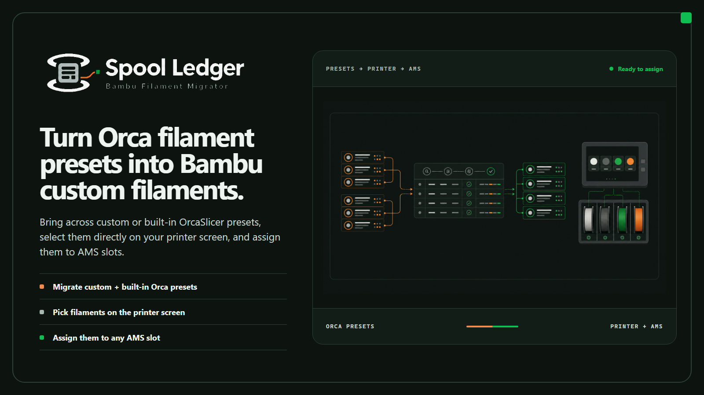

  

<h1 align="center">Spool Ledger</h1>

  <strong>Bambu Filament Migrator</strong> 
  Turn custom or built-in OrcaSlicer filament presets into Bambu custom filaments you can select on your printer screen and assign to AMS slots.

  <code>Custom + built-in Orca presets</code>&nbsp;&nbsp;·&nbsp;&nbsp;<code>Printer-selectable</code>&nbsp;&nbsp;·&nbsp;&nbsp;<code>AMS-ready</code>

## What Spool Ledger does

Spool Ledger takes filament presets you already trust—your own custom presets or OrcaSlicer's built-in presets—and converts them into Bambu custom filaments that appear on the printer screen and can be assigned to AMS slots. Before anything is written, it freezes the resulting file plan for review; afterward, it records local execution and synchronization evidence as separate states.

> [!IMPORTANT]
> This repository currently contains the approved product design, interactive UI prototype, and implementation handoff. Prototype interactions demonstrate the intended workflow; they are not production migration evidence.

## Workflow

| Stage | Operator intent | Product responsibility |
|---|---|---|
| **1. Setup** | Choose source presets, naming rules, and target hardware. | Catalog only supported profile roots and preview exact output names. |
| **2. Review plan** | Inspect every proposed write before committing. | Freeze a deterministic plan and surface blocked or conflicting operations. |
| **3. Run & evidence** | Commit the reviewed transaction and observe its progress. | Stage, validate, back up, commit, journal, and record each evidence level independently. |
| **4. Restore** | Reverse only files still owned by the selected run. | Restore journal-owned paths whose current hashes still match, without unpacking a whole account. |

## Product tour

The following slots define the screenshots needed from the working application. Replace each note with the matching image only after the state has been captured from a real run.

### Initial inventory

> **Screenshot slot:** `docs/screenshots/inventory-loading.png`  
> Capture the centered loading indicator after the total has been discovered, with the real `loaded of total` count and progress bar visible. Use a 1440×900 viewport. An optional short GIF may accompany the still if the motion needs demonstrating.

<!--
Replace the slot above with:

Capture note: use the real detected total; do not stage or invent profile counts.
-->

### Setup workspace

> **Screenshot slot:** `docs/screenshots/setup-workspace.png`  
> Show source selection, the naming composer, hardware targets, and the enabled Build migration plan action in one wide frame. Prefer the dark theme as the primary product screenshot. Mask account identifiers without obscuring the workflow.

<!--
Replace the slot above with:

Capture note: 1440×900, three-column workspace visible, no open menus or hover-only states.
-->

### Frozen plan review

> **Screenshot slot:** `docs/screenshots/review-plan.png`  
> Capture the deterministic operation table after a real plan has been built. Include at least one state that demonstrates why an operation is allowed or blocked, while keeping personal paths and identifiers masked.

<!--
Replace the slot above with:

Capture note: keep the plan status, operation table, and commit action within the frame.
-->

### Run and evidence

> **Screenshot slot:** `docs/screenshots/run-evidence.png`  
> Capture an in-progress or completed local transaction with the phase list and highest evidence reached visible together. The image must preserve the distinction between local creation, Bambu Studio loading, cloud ID assignment, and operator-confirmed AMS verification.

<!--
Replace the slot above with:

Capture note: use a real run receipt; redact tokens, account IDs, and sensitive local paths.
-->

### Restore preview

> **Screenshot slot:** `docs/screenshots/restore-preview.png`  
> Show the run receipt beside the path-specific restore preview. A useful capture includes both a safe journal-owned path and a path excluded because it changed after the run.

<!--
Replace the slot above with:

Capture note: the restore count and path statuses must come from the same real run receipt.
-->

### Light and dark themes

> **Screenshot slot:** `docs/screenshots/theme-comparison.png`  
> Place equal-size light and dark captures of the same Setup state side by side. Keep selection, scroll position, window size, and data identical so the comparison reflects only the theme.

<!--
Replace the slot above with:

Capture note: capture each theme at 1440×900, then combine without resizing either application frame disproportionately.
-->

## Safety model

- Nothing is written until the operator reviews and commits a frozen plan.
- Local artifact creation does not imply cloud synchronization.
- Cloud ID assignment does not imply AMS visibility.
- AMS verification remains an explicit, operator-confirmed evidence level.
- Normal recovery restores only journal-owned paths whose current hashes still match the committed run.
- The ZIP backup is disaster-recovery evidence, not permission to overwrite an entire account.

## Design and implementation handoff

- [`bambu-filament-migrator.html`](bambu-filament-migrator.html) is the interactive product prototype.
- [`DESIGN.md`](DESIGN.md) defines the application structure, states, interactions, and implementation constraints.
- [`brand-identity-directions.md`](brand-identity-directions.md) records the selected Spool Ledger identity.
- [`spool-ledger-lockup-transparent.png`](spool-ledger-lockup-transparent.png) is the approved horizontal product lockup prepared for application chrome.

Implementation commands, packaged downloads, and compatibility claims should be added only when the corresponding production behavior has been built and verified.
